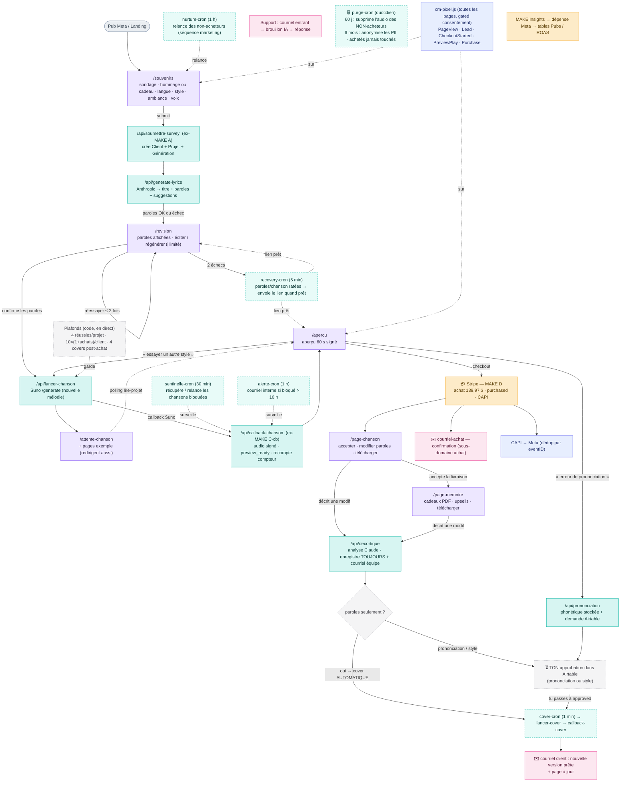

# Chanson Mémoire — Flux complet (carte vivante)

> Document maintenu par Claude + Maxime. Le diagramme ci-dessous se rend automatiquement sur
> GitHub, Notion, et tout éditeur Mermaid. Le narratif sous le diagramme couvre **tout** : pages,
> fallbacks, courriels, automatisations (crons), corrections de chanson, purge Loi 25, mesure.
> Dernière mise à jour : 2026-06-25 (après cutover Make → code).

---

## 1. Diagramme

**Légende :** 🟪 page client · 🟦 fonction Netlify · 🟦╌ cron (planifié) · 🟧 Make (ce qui reste) · ⬜ service externe · 🩷 courriel · 🟦 marketing.

---

## 2. Le tunnel, étape par étape (avec tous les fallbacks)

**1. Acquisition** → pub Meta / landing → bouton vers `/souvenirs`. Le pixel (gated consentement) pose `PageView`.

**2. `/souvenirs`** — sondage : hommage **ou** cadeau (les ambiances s'adaptent), langue, style musical, voix, souvenirs. Token UUID généré au chargement. Capte utm / fbc / fbp. À l'envoi → `Lead`.

**3. `/api/soumettre-survey`** (remplace MAKE A) — nettoie le texte, **exige un token UUID** (anti-bot). En mode `SURVEY_DIRECT=1` : crée le **Client** (upsert par courriel), le **Projet** (toutes les réponses + utm + `commercial_status=preview_only` + `funnel_step=lyrics_generated`), appelle `generate-lyrics`, crée la **Génération** (paroles). `typecast:true` → aucune option select manquante ne bloque.

**4. `/api/generate-lyrics`** — Anthropic écrit titre + paroles + suggestions (hommage / cadeau / régénération selon le cas).

**5. `/revision`** — paroles affichées (propres, sans balises). Le client peut **régénérer autant de fois** qu'il veut (décrit ses changements).
   - **Fallback paroles ratées :** si la génération échoue, bouton **« Réessayer »**. Après **2 échecs**, le bouton disparaît et un message annonce un **courriel d'ici 24-48 h** → `recovery-cron` relance et envoie le lien dès que prêt.

**6. `/api/lancer-chanson`** — quand le client confirme ses paroles : lance Suno (`/generate`). Vérifie les **plafonds** (4 chansons réussies/projet, 10×(1+achats)/client). Envoie la version **phonétique** à Suno si elle existe, garde les paroles propres à l'affichage.

**7. `/attente-chanson`** — page d'attente (sonde `lire-projet`). Les **pages exemple** (vidéo, paroles) que le client ouvre pendant l'attente **redirigent aussi** vers l'aperçu quand la chanson est prête.
   - **Fallback chanson lente / pépin :** après ~8 min, popup « on t'envoie le lien par courriel d'ici 24-48 h » + signale `recovery-cron`. En arrière-plan, `sentinelle-cron` (30 min) récupère/relance les chansons bloquées sans brûler de crédits ; `alerte-cron` (1 h) prévient l'équipe si bloqué > 10 h.

**8. `/api/callback-chanson`** (remplace MAKE C-cb) — reçoit le callback Suno : ré-héberge l'audio sur Cloudinary en **authenticated** (aperçu protégé/signé), passe la Génération à `audio_generated`, le Projet à `funnel_step=preview_ready`, **recalcule le compteur**.

**9. `/apercu`** — aperçu **60 s signé** (le full song n'est jamais exposé avant achat). Trois branches :
   - **« Essayer un autre style »** → relance `lancer-chanson` (compte dans le plafond).
   - **« Erreur de prononciation »** → `/api/prononciation` : Claude propose la phonétique, la stocke, et crée une **demande dans Airtable** + courriel équipe.
   - **« Acheter »** → checkout Stripe. Le pixel pose `CheckoutStarted` ; le 1er play pose `PreviewPlay`.

**10. Achat (Stripe → MAKE D)** — passe le Projet à `purchased`, pose le funnel, envoie `courriel-achat` (depuis le sous-domaine **achat**, lien = **étape courante**), envoie le `Purchase` (pixel + CAPI, dédup).

**11. `/page-chanson`** — le client **accepte** la livraison (signature/preuve Loi 25), télécharge. Il peut **modifier les paroles** (illimité) → voir le flux corrections.

**12. `/page-memoire`** — page commémorative : **cadeaux PDF** (les paroles), **upsells** (instrumentale, vidéo paroles vivantes), téléchargements.

---

## 3. Corrections de chanson (le flux le plus subtil)

Une demande de modification (page-chanson / page-memoire) passe par **`/api/decortique`** :
- La demande est **TOUJOURS enregistrée** dans Airtable + **courriel équipe** (même si l'analyse Claude échoue → jamais de demande perdue).
- **Routage automatique :**
  - **Paroles seulement** (ni prononciation, ni style) → **approuvée automatiquement** → `cover-cron` régénère le cover (mélodie préservée, nouvelles paroles) → courriel client + page à jour. Tu reçois quand même la **trace** « auto-approuvé ».
  - **Prononciation ou style** → `approval_status=pending` → **tu approuves dans Airtable** → `cover-cron` → cover → courriel client.
- Les **paroles affichées** restent propres ; la version **phonétique** est envoyée à Suno.
- La prononciation sur l'**aperçu (avant achat)** crée aussi une demande Airtable et aboutit à un **cover** (lancer-cover fonctionne désormais avant achat aussi).

---

## 4. Tous les courriels (Mailgun)

| Courriel | Quand | Domaine |
|---|---|---|
| **Récupération** (paroles/chanson ratées) | quand c'est enfin prêt (`recovery-cron`, 5 min) | marketing (`nathalie@info`) |
| **Confirmation d'achat** (`courriel-achat`) | à l'achat | achat |
| **Modification reçue / nouvelle version** (`decortique`, `callback-cover`) | demande + livraison du cover | achat |
| **Prononciation / correction — alerte équipe** | à chaque demande | interne (`TEAM_NOTIFY_EMAIL`) |
| **Nurture** (relance non-acheteurs) | séquence (`nurture-cron`, 1 h) | marketing |
| **Support** | réponse aux courriels entrants (`brouillon-cron` → `repondre-courriel`) | support |

---

## 5. Automatisations (crons Netlify)

| Cron | Fréquence | Rôle |
|---|---|---|
| `sentinelle-cron` | 30 min | récupère / relance les chansons bloquées |
| `alerte-cron` | 1 h | alerte interne si une chanson reste bloquée > 10 h |
| `cover-cron` | 1 min | déclenche les covers approuvés (auto ou par toi) |
| `recovery-cron` | 5 min | envoie les courriels de récupération |
| `nurture-cron` / `sequences-cron` | 1 h | séquences marketing |
| `purge-cron` | quotidien | purge Loi 25 (voir §6) |
| `brouillon-cron` / `envoyer-cron` | 1 min | support (brouillons IA + envoi) |

---

## 6. Loi 25 — purge automatique

`purge-cron` (quotidien) sur les projets **NON achetés** :
- **60 jours** → supprime les fichiers audio Cloudinary.
- **6 mois** → anonymise les données personnelles (nom, courriel, souvenirs, paroles), en gardant le marketing (utm, dates, compteurs).
- **Projets achetés : jamais touchés.** Dry-run par défaut ; suppression réelle si `PURGE_ACTIF=1`.
- Durées indiquées dans la politique de confidentialité (§8 « Conservation »).

---

## 7. Mesure & marketing

- **`cm-pixel.js`** sur toutes les pages, **gated consentement** : PageView · Lead · CheckoutStarted · PreviewPlay · Purchase (eventID = hash `token.event` pour la dédup).
- **CAPI** → Meta côté serveur.
- **MAKE Insights** : tire la dépense Meta → tables `Pubs` / `Pubs_Performance` → **ROAS réel** (jointure utm_content ↔ pub).

---

## 8. Code vs Make

- **100 % Netlify (code) :** sondage, génération, callback, corrections, livraison, comptage, courriels, purge.
- **Make ne garde que :** MAKE D (Stripe), MAKE Insights (Meta), jointures Pub/Hook.
- **Services externes :** Suno (audio), Cloudinary (hébergement signé), Anthropic (paroles/analyse), Stripe, Mailgun, Meta. **Airtable** = base de données (Clients · Projets · Generations).
